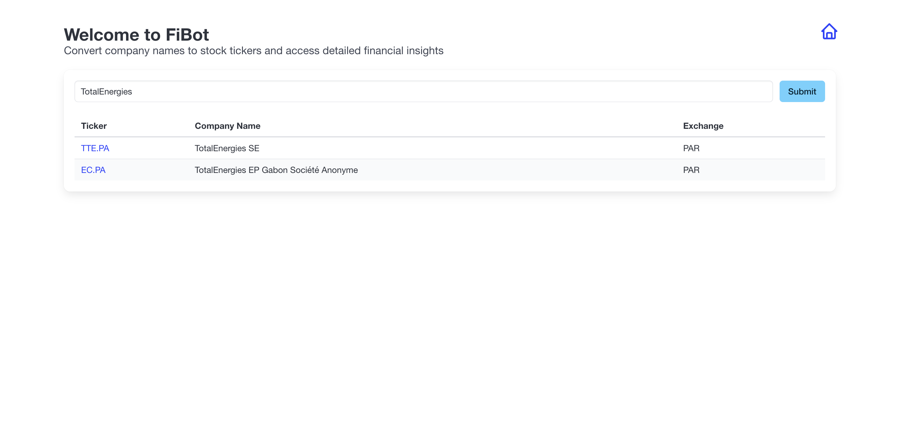
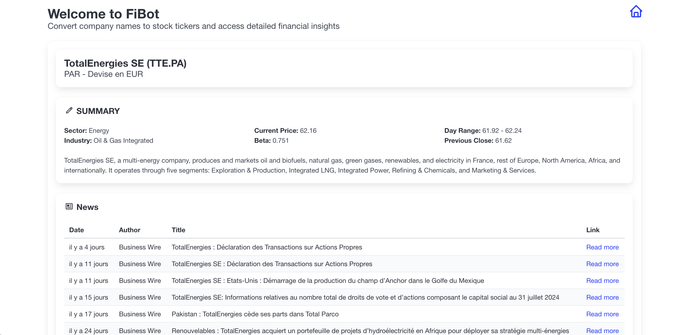

# FiBot - Enlighten Your Investment Strategy

**Started:** January 9, 2024

FiBot is a Flask-based web application that allows users to easily look up stock tickers by company name and retrieve detailed financial information and recent news about the companies. Designed with investors in mind, FiBot helps users make informed decisions by providing key data and insights directly from the web.

---

## Screenshots

Here are some screenshots showcasing the interface:




---

## Features

- **Company Name to Ticker Conversion:**  
  Simply input a company name, and FiBot will retrieve the corresponding stock ticker, along with the exchange where the stock is listed.

- **Detailed Ticker Information:**  
  Click on a ticker to access a comprehensive overview of the stock, including sector, industry, current price, beta, day range, previous close, and more.

- **Latest News Integration:**  
  Stay updated with the latest news articles related to the selected company. FiBot displays the most recent news with links to full articles, helping you keep a pulse on market sentiment.

---

## Technologies and Libraries

### Web Scraping

FiBot uses web scraping techniques to gather the latest stock information and news directly from financial websites. Web scraping involves programmatically accessing web pages, extracting relevant data, and displaying it in a user-friendly format. In FiBot, this is primarily achieved using the following tools:

- **Selenium**: A powerful web scraping tool that automates browser actions, allowing FiBot to interact with dynamic web pages and extract information such as company names, tickers, and related news articles.

- **yfinance**: A library to fetch detailed financial data for specific stock tickers. `yfinance` is a Python library that wraps the Yahoo Finance API, enabling easy access to stock market data.

---

## Project Structure

```plaintext
app/
├── app.py                   # Main Flask application script
├── templates/               # HTML templates
│   ├── base.html            # Base template for common layout
│   ├── index.html           # Home page template
│   ├── ticker.html          # Ticker details page template
├── static/
│   ├── styles.css           # Custom CSS styles
│   ├── img/                 # Custom CSS styles
├── functions.py             # Helper functions for data retrieval
└── README.md                # Project documentation
```

---

## How to Run the Project

1. **Clone the Repository:**

   ```bash
   git clone <repository-url>
   cd <repository-directory>
   ```

2. **Install Dependencies:**

   Make sure you have Python installed, then install the required Python packages:

   ```bash
   pip install -r requirements.txt
   ```

3. **Run the Flask Application:**

   ```bash
   python app/app.py
   ```

   The application will be accessible at `http://127.0.0.1:5000/`.

4. **Access the Application:**

   - **Home Page:** Enter a company name to retrieve its ticker and exchange information.
   - **Ticker Details:** Click on a ticker from the results to view more detailed information, including the latest news.

---

## Templates Overview

- **`base.html`**  
  Defines the basic layout of the application, including the navigation and content sections, with a home icon for easy navigation.

- **`index.html`**  
  Contains a form for users to input a company name and a table to display search results.

- **`ticker.html`**  
  Displays detailed information about a specific stock ticker, including key financial metrics and recent news.

---

## License

This project is licensed under the MIT License. See the [LICENSE](LICENSE) file for more details.
